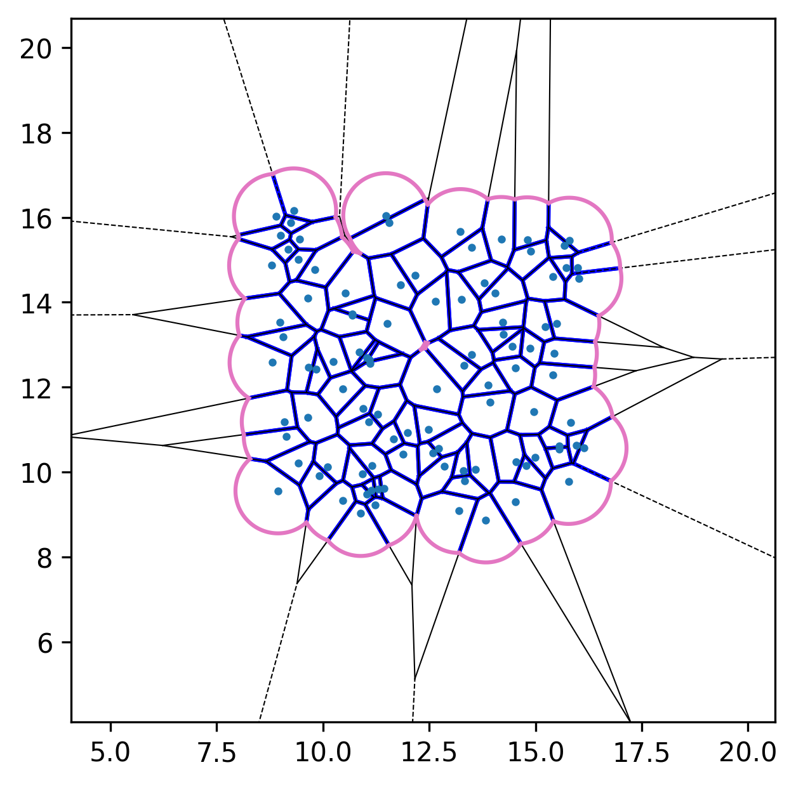

[](https://github.com/wwang721/py-afv/actions/workflows/tests.yml?query=branch:main)
[](https://codecov.io/github/wwang721/py-afv/tree/main)

# py-afv

Python code that implements the **active-finite-Voronoi (AFV) model**.
The AFV framework was introduced and developed in, for example,
 [[Soft Matter **19**, 9389 (2023)](https://doi.org/10.1039/D3SM00327B)] and [[Phys. Rev. E **98**, 042418
(2018)](https://doi.org/10.1103/PhysRevE.98.042418)].


## Installation

This project uses [`uv`](https://docs.astral.sh/uv/) for Python package management.

After cloning the repository, Linux/macOS users (Windows users: see [below](#windows-mingw-gcc)) can synchronize the dependencies with
```bash
uv sync --dev
```
or simply `uv sync` if you only intend to run the core code without development dependencies.

**Notes:**
> * `tqdm` is included in the *dev* group. Some scripts in [`examples`](/examples/) rely on `tqdm`; if you did not sync the development dependency group, you may need to add it manually via `uv add tqdm`.
> 
> * The current version requires **Cython** (and therefore a working C/C++ compiler), though [a fallback backend](/afv/finite_voronoi_fallback.py) (based on early pure-Python release) is also implemented. If the Cython compiled extension is accidentally removed or corrupted, you can reinstall the package with `uv sync --reinstall-package py-afv` or recompile it with `uv run setup.py build_ext --inplace`.
For the old pure-Python implementation with no C/C++ compiled dependencies, see **[v0.1.0](https://github.com/wwang721/py-afv/releases/tag/v0.1.0)**.
>

### Windows MinGW GCC
If you are using **MinGW GCC** (rather than MSVC) on Windows, add a `setup.cfg` at the repository root
```ini
# setup.cfg
[build_ext]
compiler=mingw32
```
It will then work in the same way.
With this configuration in place, you even no longer need to pass the `--compiler=mingw32` flag when trying to compile with `uv run python setup.py build_ext --inplace`.


## Running tests

The current CI status of the test suite, run via [GitHub Actions](/.github/workflows/tests.yml), is shown in the badge at the top of this file.

To run the full test suite locally (located in [`tests`](/tests/)):
```bash
uv run pytest
```
You can also include coverage options such as `--cov` if desired.

**Notes:** 
> * A comparison against the MATLAB implementation from [[Soft Matter **19**, 9389 (2023)](https://doi.org/10.1039/D3SM00327B)] is included in [test_core.py](/tests/test_core.py).
> * Not like [v0.1.0](https://github.com/wwang721/py-afv/releases/tag/v0.1.0), the current test suite is designed to raise errors if the Cython backend is not available, even though a pure-Python fallback implementation is provided.

## Usage

Example scripts are provided in [`examples`](/examples/). They can be run using
```bash
uv run <script_name>.py
```

Below are representative simulation snapshots generated using the code:
| Initial configuration |
|-----------------------|
|  |

| After relaxation |
|------------------|
|  |

| Active dynamics enabled |
|-----------------|
|  |
